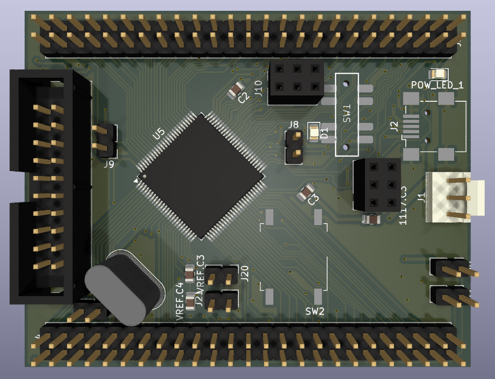
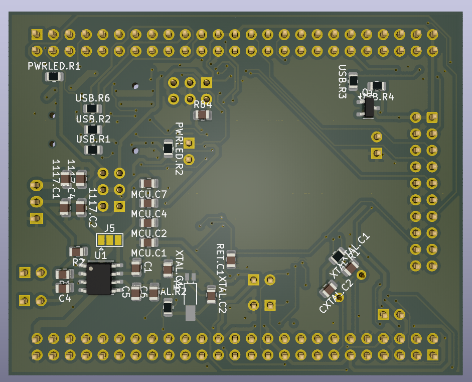
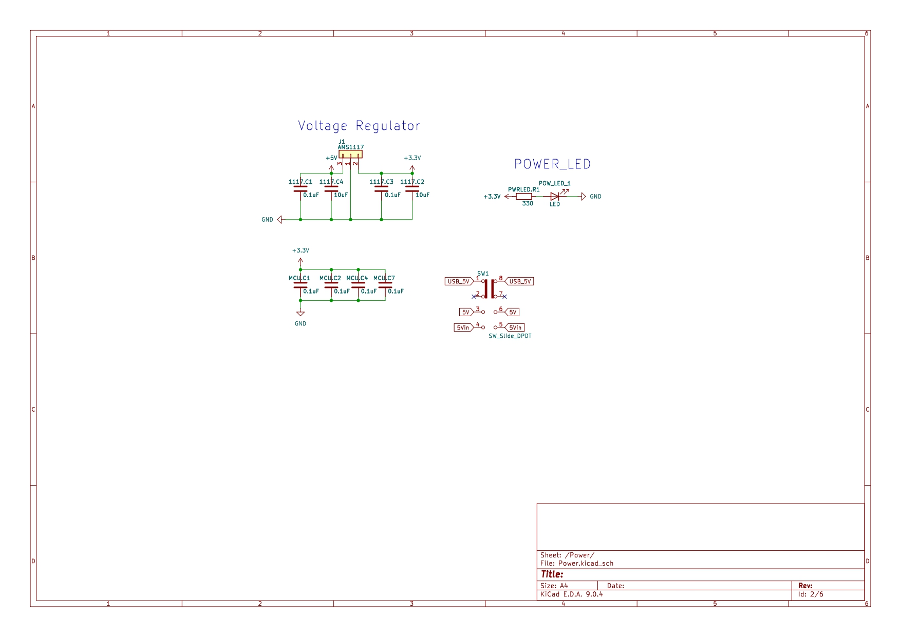
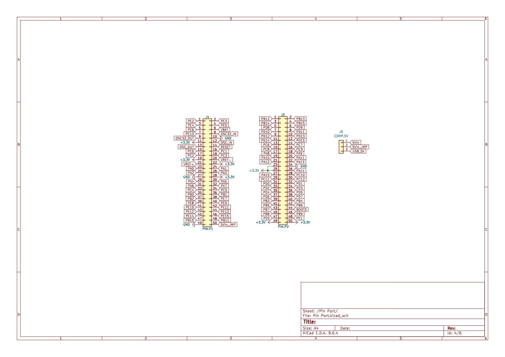
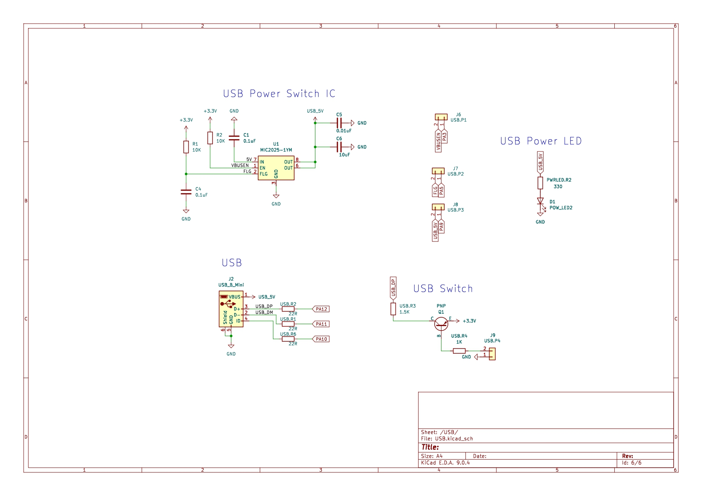
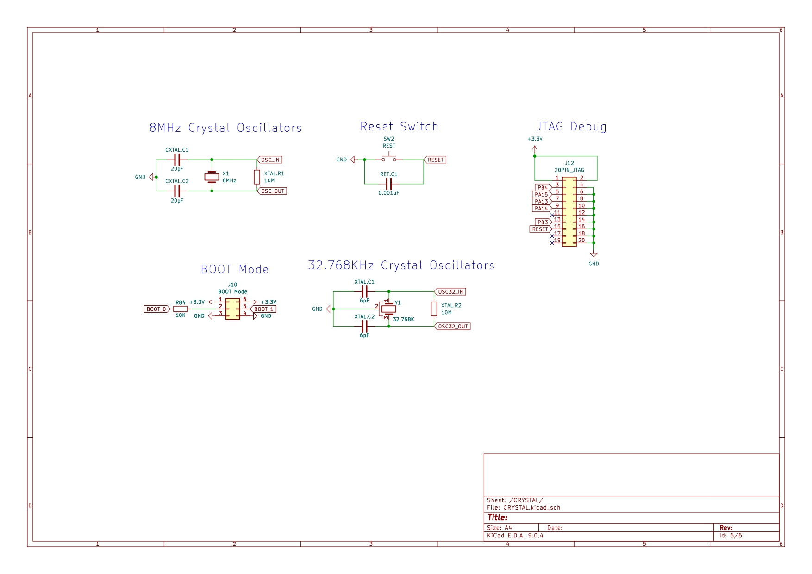
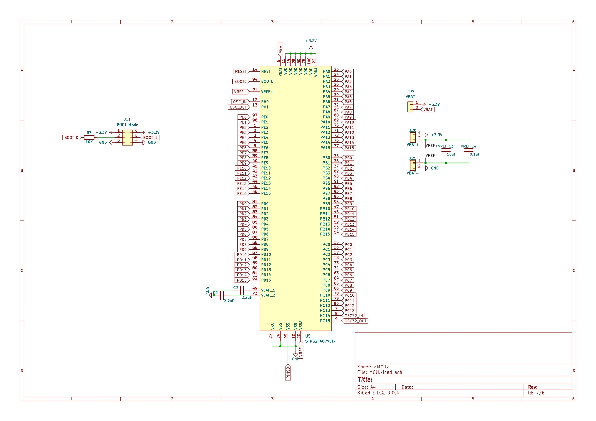

# STM32F4Core Hardware Design

## 🔎 Overview
The **STM32F4Core Board** is a custom core platform built on the **STM32F407VETx** MCU.  
It provides stable power regulation, rich GPIO breakouts, USB connectivity, accurate system/RTC clocks, and full JTAG/SWD debug support for embedded development.

---

## 📸 PCB Overview
| Top View | Bottom View |
|----------|-------------|
|  |  |

---

## 📑 Design Resources
- **Schematics**: [STM32F4Core.pdf](STM32F4-Demo-Board.pdf) (6-page schematic for quick view)  
- **EDA Tool**: KiCad (v7)  

---

## 🔧 Key Hardware Notes
- **MCU**: STM32F407VETx (ARM Cortex-M4, 168 MHz, FPU)  
- **Power**: 5 V input → AMS1117 regulator → 3.3 V rail, with on/off slide switch & LED indicator  
- **Clocks**: 8 MHz main crystal + 32.768 kHz RTC crystal  
- **USB**: USB Mini-B connector with **MIC2025-1YM** power switch  
- **GPIO**: PA–PE group pins exposed to headers (J3/J4/J5)  
- **Debug**: 20-pin JTAG header (J12), boot-mode jumper (J11), reset switch (SW2)  

---

## 🧩 Schematic Highlights

### 1) Power
  
- **Regulator**: AMS1117 (5 V → 3.3 V)  
- **Indicators**: Power LED (POW_LED_1)  
- **Switch**: Slide switch (SW_Slide_DPDT) for on/off control  

### 2) Pin Ports
  
- **Headers**: J3, J4, J5  
- **Signals**: MCU GPIO (PA/PB/PC/PD/PE), reset, oscillator pins  
- **Use**: Sensor/actuator connections, external module interfacing  

### 3) USB
  
- **Connector**: USB Mini-B (J2)  
- **Power Switch**: MIC2025-1YM, with EN/FLG signals to MCU  
- **Signals**: Provides regulated **USB_5V** rail (with current-limit & flag)  
- **Note**: **Power-only design** — no D+/D− data lines connected to MCU. 

### 4) Clocks & Debug
  
- **Crystals**: 8 MHz (system), 32.768 kHz (RTC)  
- **Reset**: Push switch (SW2)  
- **Debug**: 20-pin JTAG header (J12)  

### 5) MCU
  
- **Chip**: STM32F407VETx  
- **Support**: VCAP capacitors, bypass network, boot-mode jumper (J11)  
- **Role**: Main controller for application logic & peripherals  

---

## ✅ Progress
- [x] Schematics completed (6 pages)  
- [x] PCB prototype fabricated (Rev. A)  
- [x] Power rails validated (5 V → 3.3 V)  
- [x] JTAG/SWD debug verified   
- [x] Full GPIO validation in progress  
