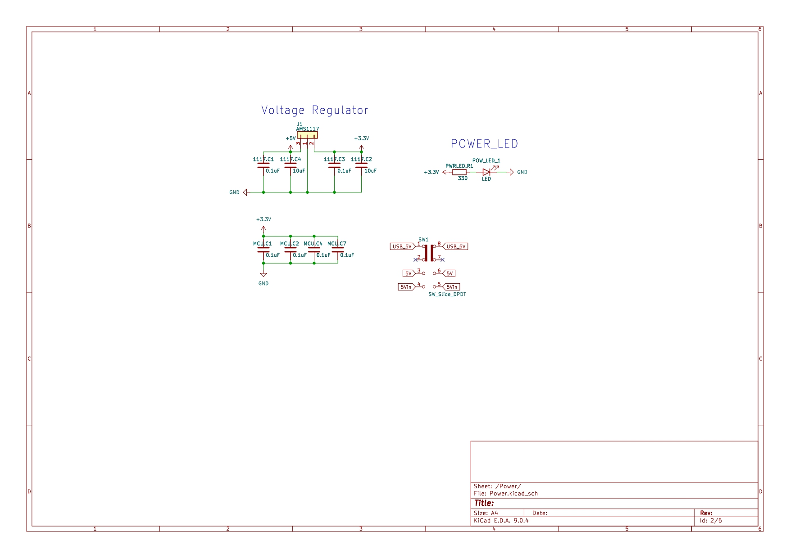
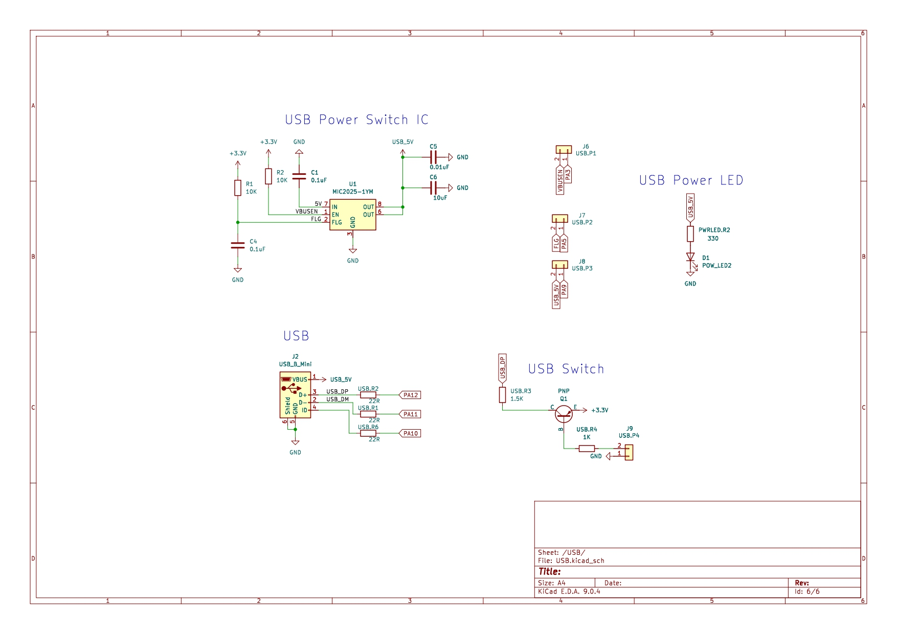
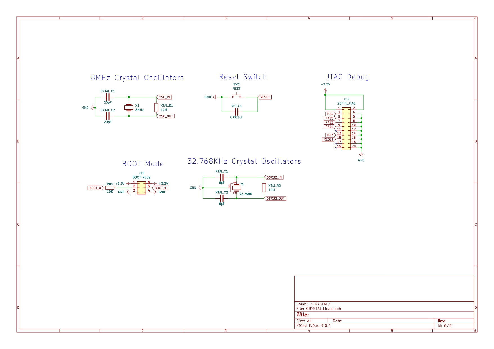
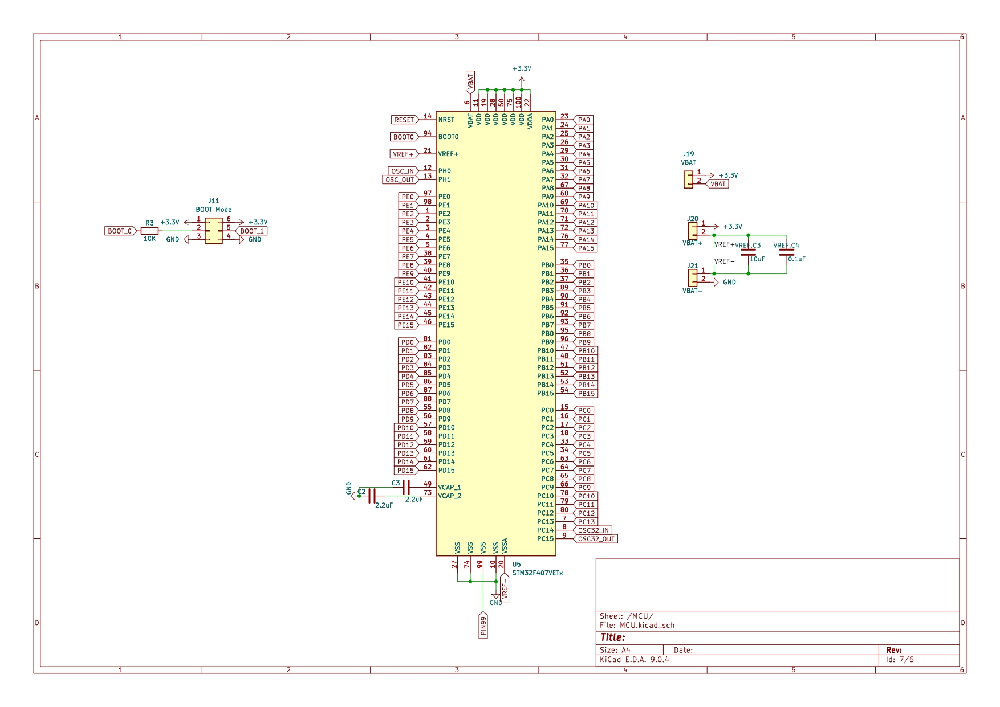

# STM32F4Core Board – Schematic Analysis Report
---

## 📑 Table of Contents
1. [Power](#1-power-전원부)  
2. [Pin Port](#2-pin-port-핀-포트)  
3. [USB](#3-usb)  
4. [Crystal](#4-crystal-크리스탈-오실레이터)  
5. [MCU](#5-mcu-마이크로컨트롤러-유닛)  
6. [Conclusion](#6-결론)  

---

## 1. Power (전원부)

- **Function**: Converts external 5V input into a regulated 3.3V supply for the MCU and peripherals.  
- **Components**:  
  - AMS1117 regulator (J1)  
  - Power LED (POW_LED_1) with resistor (330Ω)  
  - Slide switch (SW_Slide_DPDT, SW1) for power control  
  - Decoupling capacitors (0.1µF, 10µF) for stability  

---

## 2. Pin Port (핀 포트)

- **Function**: Exposes STM32F407VETx GPIOs through external connectors (J3, J4, J5).  
- **Available Pins**:  
  - GPIO groups: PA, PB, PC, PD, PE  
  - Clock pins: OSC_IN, OSC_OUT, OSC32_IN, OSC32_OUT  
  - Reset and Boot pins  
- **Purpose**: Enables flexible interfacing with sensors, actuators, or other controllers.  

---

## 3. USB

- **Function**: Provides USB communication via a Mini-B connector (J2).  
- **Components**:  
  - MIC2025-1YM USB power switch (U1)  
  - Data lines: USB_DP, USB_DM  
  - Protection & series resistors (22Ω)  
  - Power LED (POW_LED2)  
- **Notes**: Supports regulated USB 5V input, current limiting, and device connectivity.  

---

## 4. Crystal (크리스탈 오실레이터)

- **Function**: Provides accurate clock sources for the MCU.  
- **Components**:  
  - 8MHz main oscillator (X1) with load capacitors (20pF)  
  - 32.768kHz RTC crystal (Y1) with 6pF capacitors  
  - BOOT Mode selector (J10)  
  - Reset switch (SW2)  
  - 20-pin JTAG/SWD connector (J12) for debugging  

---

## 5. MCU (마이크로컨트롤러 유닛)

- **Model**: STM32F407VETx (ARM Cortex-M4)  
- **Function**: Central controller handling all peripherals and system logic.  
- **Connections**:  
  - VCAP capacitors (2.2µF each)  
  - Power pins (3.3V, GND)  
  - BOOT mode jumper (J11)  
  - VBAT connections (J19, J20, J21)  
  - GPIOs (Ports A–E) routed to external headers  
- **Features**:  
  - High-performance MCU core for DSP and control  
  - Rich GPIO set for flexible interfacing  
  - Supports external oscillators and USB  

---

## 6. 결론

The **STM32F4Core board** is a versatile core board designed around the STM32F407VETx MCU.  

- **Power Management**: 5V input regulated to 3.3V, with onboard monitoring LEDs and USB power switch.  
- **Expansion**: GPIO-rich design with external pin headers (J3, J4, J5).  
- **USB Support**: Integrated Mini-B port with MIC2025-based power management.  
- **Clock Accuracy**: Dual-crystal design (8MHz + 32.768kHz) ensures reliable MCU timing.  
- **Debugging**: JTAG/SWD interface available for firmware development.  

This makes the board suitable for **embedded system prototyping, robotics, sensor interfacing, and educational use cases** requiring a stable STM32F4 platform.  

---
